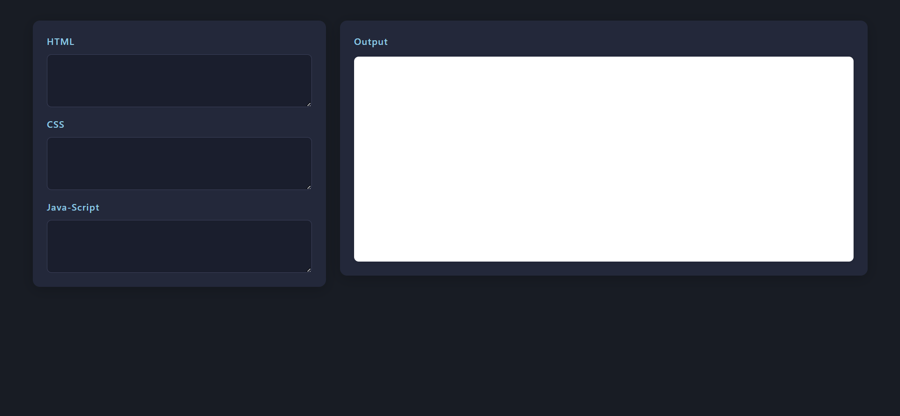

Online Code Editor

An online HTML, CSS, and JavaScript editor built using web technologies. This project allows users to write, edit, and run code directly in the browser with an instant live preview of the output.

🚀 Features

✍️ Write and edit HTML, CSS, and JavaScript in separate panels.

⚡ Live preview of output while typing.

🎨 Simple and responsive UI/UX design.

🌐 Works entirely in the browser — no installation needed.

💾 Lightweight and fast.

🛠️ Tech Stack

HTML5

CSS3

JavaScript (Vanilla JS)

Netlify (for deployment)

📌 Future Enhancements

Add option to download code as files.

Support for multiple themes (dark/light mode).

Syntax highlighting with CodeMirror/Monaco editor.

File structure support (like mini IDE).

🌍 Live Demo

👉 Try it here https://nit-code-editor.netlify.app/